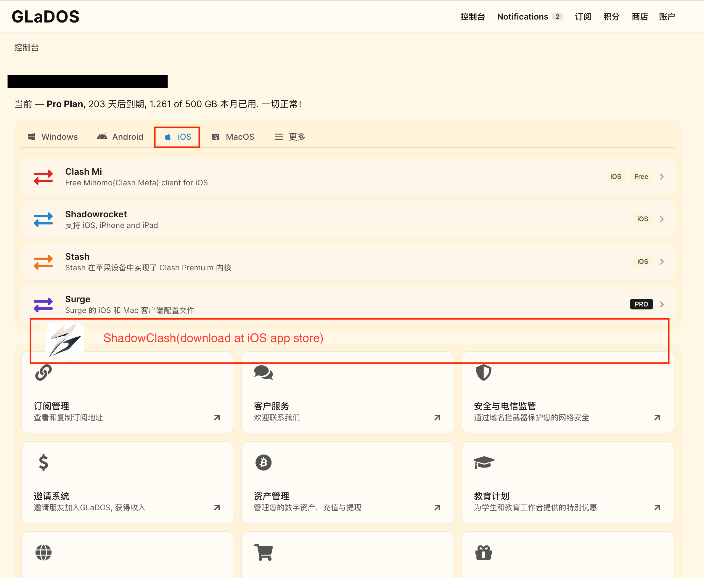
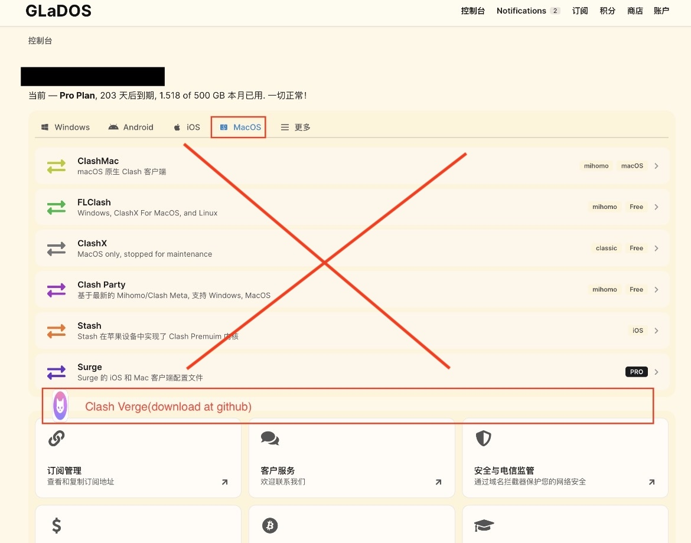
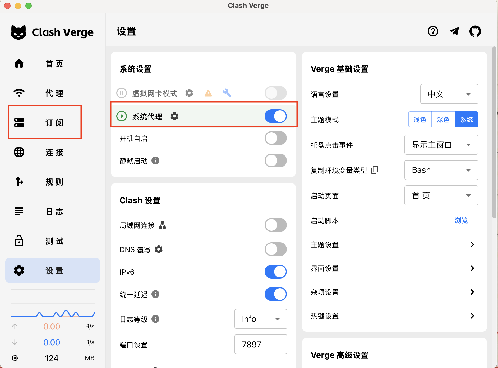

This guide explains how to set up a working VPN for beginners. 
The idea is using GlaDOS as client provider, Clash Verge as node. You can think of Verge as a intermediate network distributor for your id-key url. Can substitute to other Clash varinats for Android/Win.

---

# Step 1: 

- Register a GlaDOS account(https://glados.network/). 
- At Subscription&Management, switch the default area and save your personal url. Pay of course.
- Most listed Clash are not working but you can try.

---

# Step 2: iOS
- For iPhone&iPad, download ShadowClash on app store. 
- Open ShadowClash, Top-right + button to add QR code/file/url in Step 1.
- Connect！

---

# Step 3: MacOS

- For MacOS mac chips, most of the listed Clash are not well maintained. MacOS intel chips maybe work.
For eg, ClashMac involves download mihomo separately(mihoyo start:D),replace url locally and move to core. But ClashMac and mihomo are badly documented, with system compatibility not as described and need to by-pass security issue. FLClash are only for intel and win etc.
Highly suggest to use Clash Verge(https://github.com/clash-verge-rev/clash-verge-rev)
- Doanload Clash Verge at their github(https://github.com/clash-verge-rev/clash-verge-rev/releases)
- Open Clash Verge,
    - type your identifier on Subscription.
    - open System Monitor.
- Connect!

---

# Notes

- GlaDOS, Clash Verge are highly recommended. With great unfortunate all my previous vpn connections are gone QwQ
- Rember to click System Monitor on Clash Verge.
